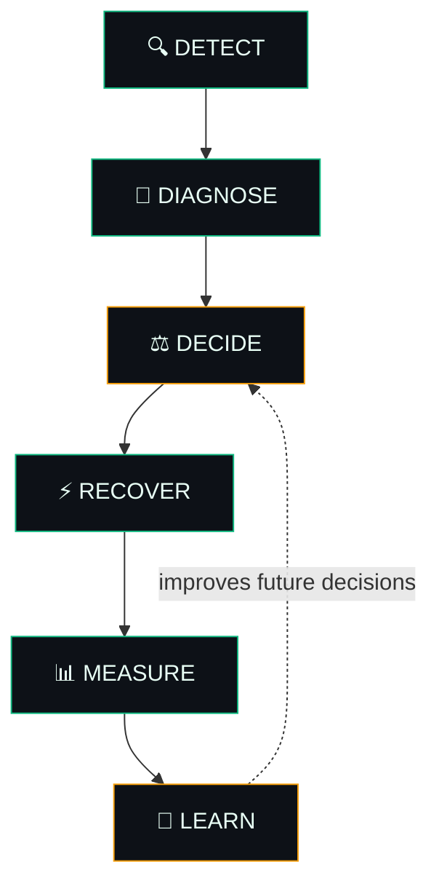
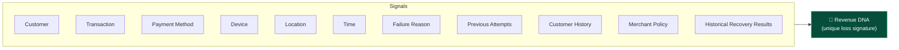
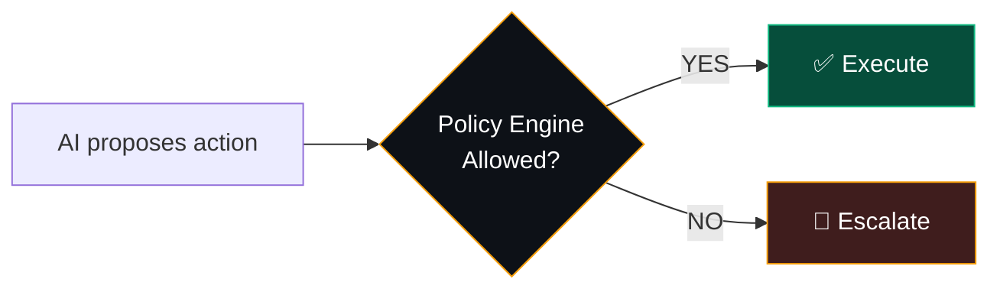
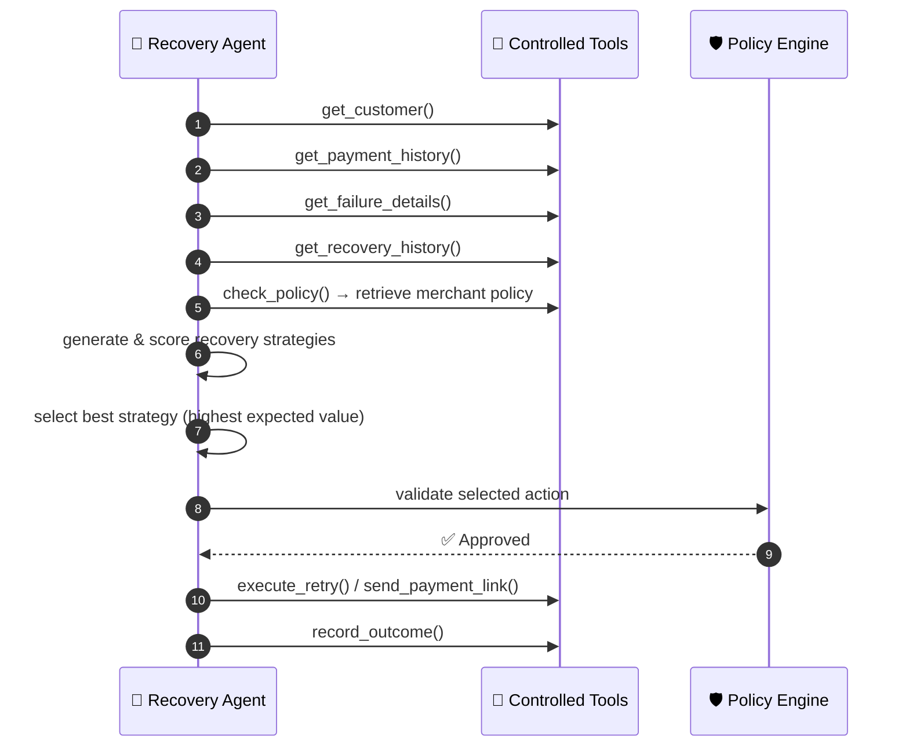
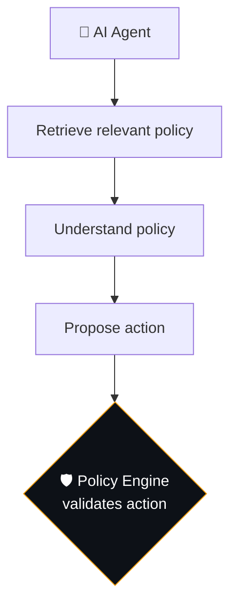
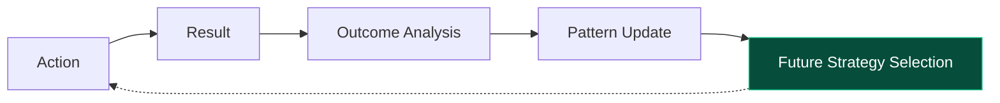
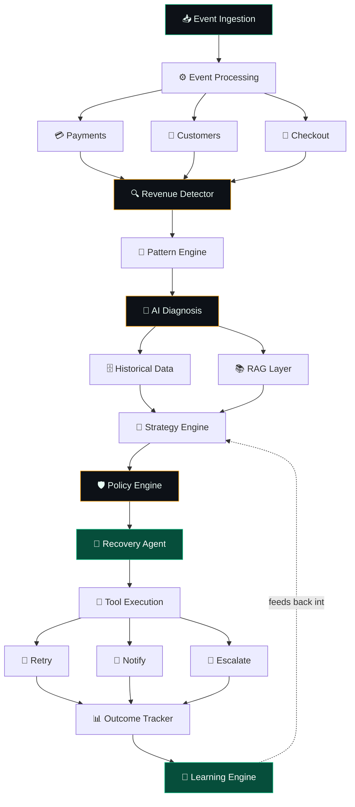
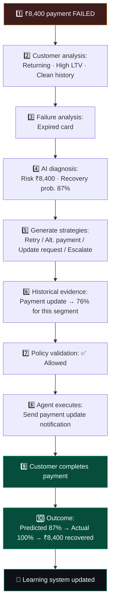
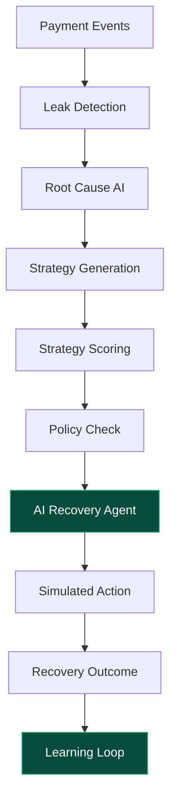

<div align="center">


<br/>


<br/>


</div>


> ### 💡 Core Innovation Statement
> **REVEnova doesn't treat every failed payment equally.** It discovers the unique patterns behind revenue leakage, determines the next-best recovery action, executes it within business constraints, and learns from the actual outcome.


## 📖 Table of Contents

<div align="center">

| | | |
|---|---|---|
| [🩸 The Problem](#-1-the-problem) | [⚙️ What REVEnova Does](#️-2-what-revenova-does) | [🎯 Target Users & Dashboard](#-3-target-users--the-merchant-view) |
| [🧬 Revenue DNA](#-4-core-concept--revenue-dna) | [📥 M1 · Event Ingestion](#-module-1--revenue-event-ingestion) | [🔍 M2 · Leak Detection](#-module-2--revenue-leak-detection) |
| [🧠 M3 · Root Cause](#-module-3--root-cause-diagnosis) | [🧪 M4 · Strategy Generator](#-module-4--recovery-strategy-generator) | [📊 M5 · Strategy Optimizer](#-module-5--recovery-strategy-optimizer) |
| [🛡️ M6 · Policy Engine](#️-module-6--policy-engine) | [🤖 M7 · Recovery Agent](#-module-7--ai-recovery-agent) | [🔁 M8 · Agent Workflow](#-agent-workflow-example) |
| [📚 M9 · RAG Layer](#-module-8--rag--knowledge-layer) | [⚡ M10 · Execution](#-module-9--recovery-execution) | [🛑 M11 · Stopping Rules](#-module-10--stopping-rules) |
| [📈 M12 · Outcome Measurement](#-module-11--outcome-measurement) | [🔄 M13 · Learning Loop](#-module-12--learning-loop) | [🏗️ Full Architecture](#️-full-system-architecture) |
| [🛠️ Tech Stack](#️-technology-stack) | [🗄️ Database Schema](#️-database-schema) | [🖥️ Dashboard Views](#️-dashboard-the-five-views) |
| [🎬 Demo Scenario](#-end-to-end-demo-scenario) | [✨ What Makes It Innovative](#-what-makes-revenova-innovative) | [⚠️ Positioning & Honesty](#️-positioning--what-we-do-not-claim) |
| [🚧 MVP Scope](#-mvp-scope) | [🗺️ Roadmap](#️-development-roadmap) | [📜 Elevator Pitch](#-the-elevator-pitch) |

</div>


## 🩸 1. The Problem

Businesses lose revenue for reasons far beyond a simple "payment failed" event:

<table>
<tr><td width="50%" valign="top">

- Payment failures
- Temporary payment-provider degradation
- Expired cards
- Subscription renewal failures
- Checkout abandonment

</td><td width="50%" valign="top">

- Repeated failed retries
- Customer payment hesitation
- Poor recovery timing
- Ineffective recovery communication
- Recovery actions that cost more than they recover

</td></tr>
</table>

Most systems handle this with a dumb, linear script:


**REVEnova replaces that script with intelligence.**

<br/>

## ⚙️ 2. What REVEnova Does

Instead of asking only *"Did the payment fail?"* — REVEnova asks:

> *"Why is this revenue at risk, what intervention has the highest probability of recovering it, is that intervention allowed, and did it actually work?"*

It runs as a **closed-loop system**, not a one-shot script:



<br/>

## 🎯 3. Target Users & The Merchant View

REVEnova is built for any business processing digital payments at volume:

<div align="center">

`SaaS` · `E-commerce` · `Subscription businesses` · `Online education` · `Marketplaces` · `Digital service providers`

</div>

Every merchant sees a live recovery dashboard:

| Metric | Example Value |
|---|:---:|
| 💸 Revenue at Risk | **₹52.4 Lakh** |
| 🎯 Predicted Recovery | **₹31.2 Lakh** |
| ✅ Actual Recovery | **₹33.8 Lakh** |
| 📈 Recovery Rate | **64.5%** |
| 📂 Active Recovery Cases | **1,842** |

<br/>

## 🧬 4. Core Concept — Revenue DNA

This is REVEnova's central differentiator. A payment failure is **never analyzed in isolation** — it's fused with every available signal into a single **revenue-loss signature**:



**Example — Revenue DNA #482:**

| Signal | Value |
|---|---|
| Customer | Returning |
| Payment | UPI |
| Device | Android |
| Bank | Bank X |
| Time | 7:30 PM |
| Failure | Timeout |
| Previous payment history | Excellent |
| Previous recovery | None |

> 🧠 **REVEnova's conclusion:** *"This pattern has historically recovered successfully using a delayed retry. Historical recovery rate: 73%."*

<br/>

## 📥 Module 1 — Revenue Event Ingestion

REVEnova continuously ingests payment and business events:

```json
{
  "transaction_id": "TXN_48291",
  "customer_id": "CUS_9281",
  "amount": 8400,
  "payment_method": "UPI",
  "device": "Android",
  "status": "failed",
  "failure_reason": "timeout",
  "timestamp": "2026-08-28T19:32:00"
}
```

**Event types handled:** Payment events · Subscription events · Checkout events · Customer events · Invoice events · Recovery events

> 📝 For the buildathon, realistic **synthetic data** can substitute for production data.

<br/>

## 🔍 Module 2 — Revenue Leak Detection

REVEnova hunts for **abnormal patterns**, not individual failed payments:

| | Normal | Current | Delta |
|---|:---:|:---:|:---:|
| UPI failure rate | 4.2% | **18.7%** | 🔺 +14.5 pts |

```text
🚨 Revenue leak detected
Affected transactions: 1,842
Revenue at risk: ₹4.82L
```

> ⚠️ A single failed transaction is **never** automatically classified as a systemic revenue leak — the detector looks for statistically abnormal deviation across a cohort.

<br/>

## 🧠 Module 3 — Root Cause Diagnosis

Once a leak is flagged, the AI investigates *why* — weighing failure reason, customer & transaction history, device, payment method/provider, timing, prior recovery attempts, cohort behavior, and merchant policy.

```text
🔬 ROOT CAUSE: Payment-channel degradation
Confidence: 91%

Evidence:
✓ Failure rate increased 4.4×
✓ Same bank affected
✓ Multiple customers affected
✓ Customer histories are normal
✓ Failures concentrated within a 40-minute window
```

This lets REVEnova tell the difference between **"the payment rail is broken"** and **"this one customer has a problem."**

<br/>

## 🧪 Module 4 — Recovery Strategy Generator

For every leak, REVEnova generates multiple candidate interventions rather than jumping to the first idea:

| Strategy | Expected Recovery | Cost |
|---|:---:|:---:|
| A · Immediate Retry | 31% | Low |
| B · Delayed Retry | 47% | Low |
| C · Alternative Payment Method | 62% | Medium |
| D · Human Escalation | 71% | **High** |

The system does **not** blindly execute the AI's first suggestion — it evaluates all of them.

<br/>

## 📊 Module 5 — Recovery Strategy Optimizer

The optimizer weighs recovery probability against cost and customer friction using:

```text
Expected Recovery Value
   = (Revenue at Risk × Probability of Recovery)
   − Intervention Cost
   − Customer Friction Cost
```

**Worked example** — Revenue at Risk = ₹4,82,000:

| Strategy | Calculation | Expected Value |
|---|---|:---:|
| A · Immediate Retry | ₹4,82,000 × 31% | ₹1,49,420 |
| B · Delayed Retry | ₹4,82,000 × 47% | ₹2,26,540 |
| **C · Alternative Payment** ⭐ | ₹4,82,000 × 62% | **₹2,98,840** |
| D · Human Escalation | ₹4,82,000 × 71% = ₹3,42,220 | *minus* high operational + human cost |

**→ Selected: Strategy C — Alternative Payment Method**, the best cost-adjusted outcome, not just the highest raw probability.

> 🧭 **Design principle:** *the LLM proposes; it is never the final authority on money.* Deterministic code enforces every financial constraint.

<br/>

## 🛡️ Module 6 — Policy Engine

Before any AI-proposed action executes, it passes through hard-coded guardrails:

| Rule | Constraint |
|---|---|
| 01 | Transaction amount > ₹1,00,000 → **human approval required** |
| 02 | Maximum automatic retries = **2** |
| 03 | Never offer a discount **> 10%** without approval |
| 04 | Never contact a customer more than **3 times in 7 days** |
| 05 | High-value customers can always be escalated to a human |



<br/>

## 🤖 Module 7 — AI Recovery Agent

The agent never touches the database directly — it operates only through a **fixed, auditable toolset**:

<div align="center">

`get_customer()` · `get_transaction()` · `get_payment_history()` · `get_failure_details()` · `get_recovery_history()`
`check_policy()` · `calculate_recovery_score()` · `generate_customer_message()`
`execute_retry()` · `send_payment_link()` · `schedule_followup()` · `escalate_to_human()` · `record_outcome()`

</div>

<br/>

## 🔁 Agent Workflow Example

Full walkthrough for a failed ₹8,400 transaction:



**Result:** *Send a secure payment-method update request.*

<br/>

## 📚 Module 8 — RAG / Knowledge Layer

Merchant-specific operational knowledge (recovery policies, payment rules, refund policies, communication rules, escalation & discount policies, subscription policies) is retrieved via RAG before the agent acts:



**Example:**
> **Agent:** *"Can I offer this customer a 20% recovery discount?"*
> **Retrieved policy:** *Maximum automatic discount = 10%. Anything above requires human approval.*
> **Result:** The 20% discount is automatically blocked.

<br/>

## ⚡ Module 9 — Recovery Execution


**Possible actions:** Retry payment · Generate payment link · Suggest alternative payment method · Send recovery notification · Schedule follow-up · Escalate to human · Stop recovery attempts

<br/>

## 🛑 Module 10 — Stopping Rules

REVEnova is explicitly designed to know when to **stop**, not just when to act:

| Condition | Result |
|---|---|
| 3 consecutive failed attempts | 🛑 Stop |
| Recovery probability < 10% | 🛑 Stop automated recovery → escalate or close case |
| Customer contacted 3 times | 🛑 Stop communication |

This directly reduces **spam, excessive retries, API cost, customer frustration,** and wasted operational effort.

<br/>

## 📈 Module 11 — Outcome Measurement

Every recovery action is logged with predicted vs. actual results:

```text
Transaction: ₹8,400
Predicted recovery: 87%
Action: Payment-method update
Result: SUCCESS
Actual recovered: ₹8,400
Recovery time: 11 minutes
```

**Merchant-level rollup:**

| Metric | Value |
|---|:---:|
| Total Revenue At Risk | ₹52.4L |
| Predicted Recovery | ₹31.2L |
| Actual Recovery | ₹33.8L |

> 🏆 **The single most important product metric is actual money recovered** — not predicted probability.

<br/>

## 🔄 Module 12 — Learning Loop

Outcomes continuously feed back into the strategy engine:



**Example evolution:**

| Stage | Alternative Payment — Predicted Recovery |
|---|:---:|
| Initial assumption | 60% |
| After observing 5,000 transactions | **74% actual** |

**Learned rule:** `High-value customer + Card failure + Returning customer → Alternative Payment → 74% historical recovery`

<br/>

## 🏗️ Full System Architecture



<br/>

## 🛠️ Technology Stack

| Layer | Choice | Why |
|---|---|---|
| **Frontend** | Next.js + TypeScript | Revenue overview, leak explorer, recovery cases, AI decisions, strategy comparison, audit logs |
| **Backend** | Python + FastAPI | AI orchestration, data processing, ML, APIs |
| **Database** | PostgreSQL | Transactions, customers, recovery cases, actions, outcomes, policies, audit logs |
| **Vector Store** | PostgreSQL + **pgvector** | Merchant policy & document retrieval — no extra infra needed |
| **AI (LLM)** | Reasoning layer | Root-cause diagnosis, structured reasoning, strategy generation, communication generation, tool selection |
| **AI (Deterministic code)** | Guardrail layer | Financial calculations, permissions, limits, policy enforcement, safety constraints |
| **Background Jobs** | Redis + Celery (or equivalent) | Scheduled retries, follow-ups, event processing, async AI jobs |

> ⚖️ **Engineering principle:** *LLM for reasoning. Deterministic code for money, permissions, limits, policies, and safety.* This separation is maintained throughout the entire system.

<br/>

## 🗄️ Database Schema

<details>
<summary><b>📐 Click to expand the full simplified schema</b></summary>

```text
users                    customers                 transactions
──────                   ─────────                 ────────────
id                       id                        id
merchant_id              merchant_id               customer_id
role                     name                       amount
                         segment                    payment_method
                         lifetime_value             status
                                                    failure_reason
                                                    timestamp

recovery_cases            recovery_strategies        recovery_actions
──────────────            ───────────────────        ─────────────────
id                        id                          id
transaction_id            case_id                     case_id
risk_score                strategy                    strategy_id
recovery_probability      predicted_recovery          action
status                    cost                        status
created_at                friction_score              timestamp

recovery_outcomes          policies                   audit_logs
──────────────────         ────────                   ──────────
id                         id                          id
action_id                  merchant_id                 case_id
amount_recovered           policy_text                 agent
success                    embedding                   decision
recovery_time                                          reason
                                                        action
                                                        timestamp
```

</details>

<br/>

## 🖥️ Dashboard: The Five Views

*"Build five excellent views rather than many mediocre pages."*

<table>
<tr><td>

**1️⃣ Executive Overview**
```text
Revenue at Risk    ₹52.4L
Recovered          ₹33.8L
Recovery Rate      64.5%
Active Cases       1,842
```

</td><td>

**2️⃣ Revenue Leak Explorer**
```text
Payment Degradation      ₹12.4L
Checkout Abandonment      ₹8.7L
Subscription Failures     ₹7.1L
Other                    ₹24.2L
```

</td></tr>
<tr><td>

**3️⃣ Recovery Case Detail**
```text
CASE #48291
Revenue at Risk:    ₹8,400
Root Cause:         Expired Card
Recovery Prob.:     87%
Recommended:        Payment Method Update
[Approve]  [Escalate]
```

</td><td>

**4️⃣ Strategy Simulator**
```text
Immediate Retry         31%
Delayed Retry           47%
Alternative Payment     62%
Human Escalation        71%
→ RECOMMENDED: Alternative Payment
```

</td></tr>
<tr><td colspan="2">

**5️⃣ Audit & Learning**
```text
AI DECISION LOG
What happened? · Why? · Which policy? · Which action? · What happened afterward? · How much recovered?
```

</td></tr>
</table>

<br/>

## 🎬 End-to-End Demo Scenario



<br/>

## ✨ What Makes REVEnova Innovative

The innovation isn't *"we used an LLM."* It's the combination of:

| # | Capability | Description |
|:--:|---|---|
| 1 | **Pattern discovery** | Finds revenue leakage that isn't obvious |
| 2 | **Root-cause intelligence** | Understands *why* revenue is at risk |
| 3 | **Strategy simulation** | Compares multiple recovery actions side by side |
| 4 | **Economic decision-making** | Weighs expected recovery against cost & friction |
| 5 | **Controlled agents** | AI executes only through restricted, auditable tools |
| 6 | **Policy enforcement** | Deterministic rules constrain every AI decision |
| 7 | **Outcome measurement** | Predicted vs. actual recovery, always tracked |
| 8 | **Continuous learning** | Successful patterns improve future decisions |

<br/>

## ⚠️ Positioning & What We Do *Not* Claim

Being precise about capability is part of the product's credibility:

| ❌ Don't say | ✅ Say instead |
|---|---|
| "REVEnova guarantees revenue recovery." | "REVEnova predicts recovery probability and optimizes interventions based on historical outcomes." |
| "The AI independently controls payments." | "The AI operates through bounded tools and deterministic policy controls." |
| "The AI learns automatically from everything." | "Recovery outcomes are captured and used to improve future strategy selection." |

<br/>

## 🚧 MVP Scope



**Approach:** build one complete end-to-end scenario first, then expand to additional revenue-loss scenarios.

<br/>

## 🗺️ Development Roadmap

| Phase | Focus |
|:--:|---|
| 1 | Synthetic payment dataset + PostgreSQL |
| 2 | Revenue leak / anomaly detection |
| 3 | Root-cause diagnosis |
| 4 | Recovery strategy scoring engine |
| 5 | Policy engine |
| 6 | AI agent + tools |
| 7 | Outcome tracking |
| 8 | Learning / recommendation loop |
| 9 | Premium dashboard |
| 10 | Demo, architecture, evaluation & documentation |

<br/>

## 📜 The Elevator Pitch

> *"What exactly did you build?"*

**REVEnova is an autonomous revenue recovery intelligence platform.** It continuously analyzes payment and customer events to identify hidden revenue leaks. When it detects a leak, it diagnoses the root cause, generates and evaluates possible recovery strategies, selects the next-best action using expected recovery and business constraints, and executes that action through a controlled AI agent. Every action is policy-validated and audited. Most importantly, REVEnova measures actual money recovered and feeds those outcomes back into its strategy engine, allowing it to improve recovery decisions over time.

<div align="center">

### ⚖️ LLM for reasoning. Deterministic code for money, permissions, limits, policies, and safety.


</div>
